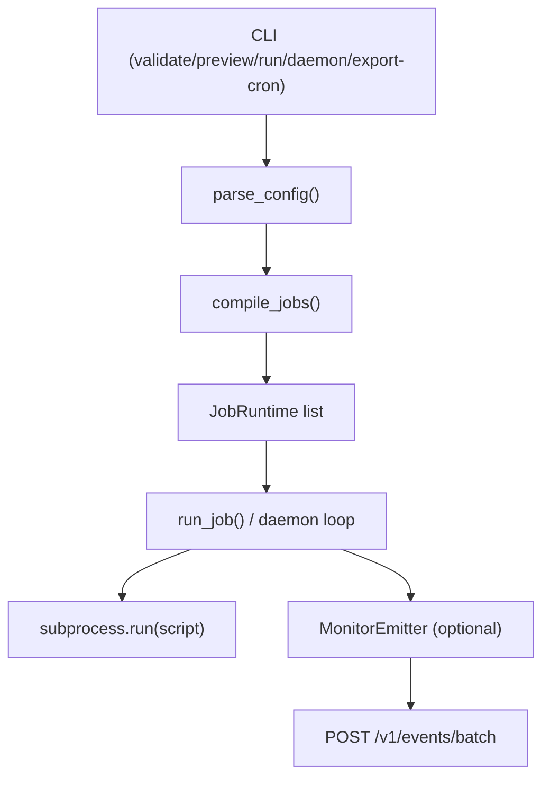

# Chief Technical Guide

This document explains Chief internals for developers who need to maintain or extend the orchestrator.

Scope:

- `chief/chief.py`
- `chief/monitor_client.py`
- `chief/chief.yaml`
- `chief/tests/test_chief.py`

For operator quick start, use `docs/CHIEF_GUIDE.md`.

## 1. System Purpose

Chief is a Python orchestrator that:

- loads jobs from YAML
- validates and compiles schedules
- executes script pipelines
- optionally runs as a long-lived scheduler daemon
- emits lifecycle telemetry to monitor service

Chief is intentionally single-process and deterministic. Most complexity is in schedule parsing, validation, and runtime dispatch rules.

## 2. Runtime Stack

- Language: Python 3.9+
- Key stdlib modules:
  - `argparse`, `subprocess`, `threading`, `zoneinfo`, `datetime`
  - `urllib.request` for telemetry HTTP sends
- External dependencies:
  - `PyYAML` for config loading
  - `croniter` for cron next-run calculations and matching

## 3. High-Level Architecture



## 4. File and Type Map

Core file: `chief/chief.py`

Important dataclasses:

- `ScriptSpec`
- `ScheduleSpec`
- `JobSpec`
- `CompiledSchedule`
- `JobRuntime`
- `ScriptRunResult`
- `JobRunResult`
- `JobState`
- `MonitorSettings`
- `MonitorEvent`

These types define the pipeline stages:

1. Raw YAML -> typed `JobSpec`
2. `JobSpec.schedule` -> `CompiledSchedule`
3. `JobRuntime` -> execution and daemon state transitions

## 5. Config Parsing Pipeline

Entry point: `parse_config(config_path)`

Stages:

1. `_load_config_payload`
2. Validate top-level keys: `version`, `defaults`, `jobs`, `monitor`
3. Parse defaults:
  - working dir
  - stop-on-failure
  - overlap policy
  - timezone
4. Parse monitor settings
5. Parse each job:
  - uniqueness of `name`
  - job-level overrides
  - `schedule`
  - `scripts`
  - job monitor/check override

Path rules:

- `working_dir` must exist and be a directory.
- Script `path` is resolved relative to job `working_dir` (if not absolute).
- Script files are validated at load time.

### 5.1 Monitor Config Parsing

Top-level monitor parser: `parse_monitor_settings(...)`

Supported keys:

- `enabled`
- `endpoint`
- `api_key`
- `timeout_ms`
- `heartbeat_seconds`
- `buffer.max_events`
- `buffer.flush_interval_ms`
- `buffer.spool_file`

Notable behavior:

- Unknown keys raise explicit `ConfigError`.
- `endpoint` must be HTTP/HTTPS.
- `heartbeat_seconds` must be `>= 1`.
- Spool path is resolved relative to config directory when not absolute.

Effective enablement:

- `effective_monitor_settings(...)` enables global emitter if any selected job has `monitor.enabled=true`, even if top-level `monitor.enabled=false`.

## 6. Scheduling DSL Internals

Parser entry point: `parse_schedule(...)`

Validation model:

- Exactly one frequency from:
  - `daily`, `weekly`, `monthly`, `yearly`, `interval`, `custom`
- Enforces allowed fields per frequency
- Enforces required fields and conflict rules
- Parses and validates global modifiers:
  - `timezone`
  - `start`, `end` (ISO datetimes)
  - `exclude` date list

### 6.1 Frequency Validation Rules (Implementation)

- `daily`
  - requires `time`
  - optional `weekdays_only` bool
- `weekly`
  - requires `day` + `time`
  - `day` supports single, list, CSV, and ranges
- `monthly`
  - requires:
    - `day_of_month + time`, or
    - `ordinal + day + time`
  - forbids mixing both forms
- `yearly`
  - requires `month + day_of_month + time`
- `interval`
  - requires `every`
  - forbids `time`
  - regex accepts `s|m|h|d`, then explicitly rejects seconds (`s`)
- `custom`
  - requires at least one of:
    - `minute`, `hour`, `day_of_month`, `month`, `day_of_week`
  - validates cron token grammar and ranges

### 6.2 Compilation to Runtime Form

Entry point: `compile_schedule(...)`

Output: `CompiledSchedule` with:

- `kind`: `pure_cron | hybrid | runtime_only`
- `cron_expr` when available
- `guard` callable
- timezone/bounds/exclusions/interval metadata

Compilation semantics:

- `daily`, `weekly`, `monthly(day_of_month)`, `yearly`, `custom` -> `pure_cron`
- `monthly(ordinal+day)` -> `hybrid`:
  - weekday cron trigger
  - runtime ordinal guard
- `interval`:
  - `m` where `60 % amount == 0` -> pure cron (`*/N`)
  - `h` where `24 % amount == 0` -> pure cron (`0 */N`)
  - `1d` -> pure cron (`0 0 * * *`)
  - otherwise `runtime_only` (for example `90m`)

## 7. Timezone and DST Semantics

Key helper: `candidate_allowed(...)`

Rule order for candidate filtering:

1. Drop nonexistent local times (spring forward gap)
2. Deduplicate ambiguous fallback time by dropping fold=1
3. Enforce `start` bound
4. Enforce `end` bound
5. Enforce `exclude` date list
6. Enforce custom guard

Next-run engines:

- Cron/hybrid: `_next_cron_after(...)` with `croniter`
- Runtime interval: `_next_interval_after(...)`

Preview generator:

- `next_run_times(...)` calls `next_run_after(...)` repeatedly
- Deduplicates by local minute slot key

## 8. Command Runtime Semantics

CLI commands:

- `validate`
- `preview`
- `run`
- `daemon`
- `export-cron`

### 8.1 `run`

- Parses config and compiles schedules.
- Selects enabled jobs (optionally one by `--job`).
- Starts monitor emitter and chief heartbeat loop.
- Runs jobs in YAML order once.
- `--respect-schedule` skips jobs not due now.
- Exit code is `1` if any executed job fails, else `0`.

### 8.2 `daemon`

Daemon state per job:

- `next_fire`
- `running_count`
- `queued_pending`

Global structures:

- `trigger_queue` (`deque[TriggerEvent]`)
- `completion_queue` (`Queue[(job_name, JobRunResult)]`)
- `active_job_name` (enforces global ordering rules)

No catch-up policy:

- On startup `next_fire` is computed as next future run.

Overlap handling:

- `skip`: drop overlapping triggers
- `queue`: allow a single pending overlap trigger
- `parallel`: allow same-job concurrency only

Determinism:

- Trigger detection follows YAML job order
- Dispatch scans queue and only launches dispatchable triggers

## 9. Script Execution Engine

Execution units:

- `run_script(...)` executes one script via `subprocess.run`
- `run_job(...)` runs scripts sequentially per job

Process model:

- Command is always Python interpreter + script path + args
- `capture_output=True` and `text=True`
- Output is captured, not streamed
- Timeout yields return code `-1`, generic exception yields `-2`

Stop-on-failure:

- If job `stop_on_failure=true`, remaining scripts are skipped after first failure.

Run identity:

- `run_id` format:
  - `{job}:{YYYYmmddHHMMSS}-{microseconds}-{pid}`

Post-job behavior:

- Computes next scheduled run and logs it
- Emits `job.next_scheduled` telemetry event

## 10. Telemetry Integration (Chief Side)

### 10.1 Monitor Event Contract

`MonitorEvent` payload includes:

- source/event type
- level/message/event timestamp
- correlation: `jobName`, `scriptPath`, `runId`, `scheduledFor`
- optional success/return code/duration
- metadata map

### 10.2 MonitorEmitter Reliability Model

`MonitorEmitter` design goals:

- never block job execution
- bounded queue
- background flush loop
- spool-to-disk fallback

Flow:

1. `emit` enqueues non-blocking
2. background thread batches and sends to `/v1/events/batch`
3. failed sends spool to JSONL
4. replay loop attempts spool resend

Close semantics:

- on shutdown, thread stops, final queue flush attempted, then spool replay attempted

### 10.3 Chief Presence Heartbeat

`ChiefHeartbeat` thread emits `chief.heartbeat` at configurable `heartbeat_seconds`.

Emission timing:

- immediate first heartbeat on start
- periodic loop until stop

Metadata:

- `ping_interval_seconds`
- `mode` (`run` or `daemon`)
- `pid`

## 11. Worker Context Injection

For each script subprocess, Chief injects:

- `CHIEF_RUN_ID`
- `CHIEF_JOB_NAME`
- `CHIEF_SCRIPT_PATH`
- `CHIEF_SCHEDULED_FOR` (when scheduled)
- `CHIEF_MONITOR_ENDPOINT` (if telemetry enabled for job)
- `CHIEF_MONITOR_API_KEY` (if configured)

Worker helper module: `chief/monitor_client.py`

- Reads context from env
- Posts `worker.message` events to monitor
- Methods: `debug/info/warn/error/critical`
- Best-effort, returns `False` on send failures

## 12. Error Model and Logging

Error classes:

- `ChiefError`: runtime/user-facing failures
- `ConfigError`: validation failures

Logging:

- file + stdout
- log file: `chief/chief.log`
- includes run-id-tagged execution entries

Runtime behavior:

- Config and command validation errors return exit code `1`
- `KeyboardInterrupt` in daemon returns `130`
- unexpected exceptions are logged with stack trace and return `1`

## 13. Testing and Developer Workflow

Primary suite: `chief/tests/test_chief.py`

Coverage areas include:

- schedule parsing and validation
- compiler mode correctness
- bounds/exclusions
- overlap mode parsing
- args passing
- monitor config and env injection

Run tests from `chief/` directory (import path expectation):

```bash
cd chief
../venv/bin/python -m pytest tests/test_chief.py -q
```

## 14. Extension Points

Common additions:

1. New schedule frequency:
  - add to `VALID_FREQUENCIES`
  - update `_validate_schedule_fields`
  - extend `_validate_frequency_payload`
  - implement in `compile_schedule`

2. New telemetry event:
  - emit via `emit_monitor_event(...)` at required lifecycle point
  - update monitor service handling if event affects checks/alerts

3. New overlap policy:
  - extend `VALID_OVERLAPS`
  - update daemon dispatch branch logic

4. Alternative execution engine:
  - replace `run_script(...)` invocation strategy while preserving `ScriptRunResult`

## 15. Known Technical Constraints

- Interval schedules have limited cron compilation. Complex intervals are runtime-only.
- Seconds intervals are intentionally unsupported.
- Daemon loop is single-process and in-memory. No distributed lock/coordinator.
- `run --respect-schedule` uses one `now` timestamp per command invocation.
- Telemetry is best-effort, not exactly-once delivery.

